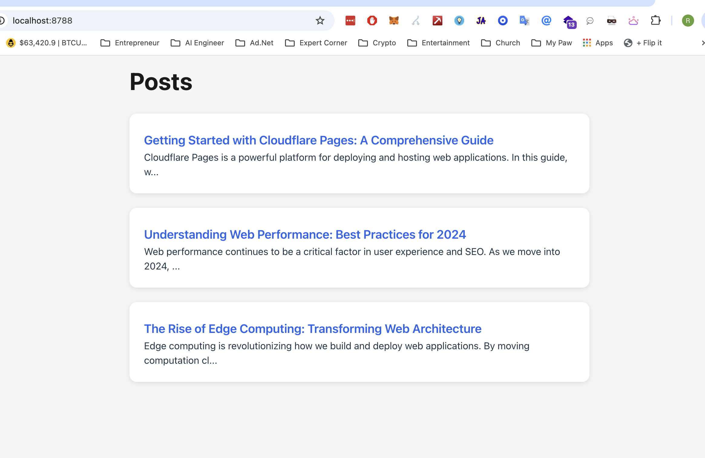
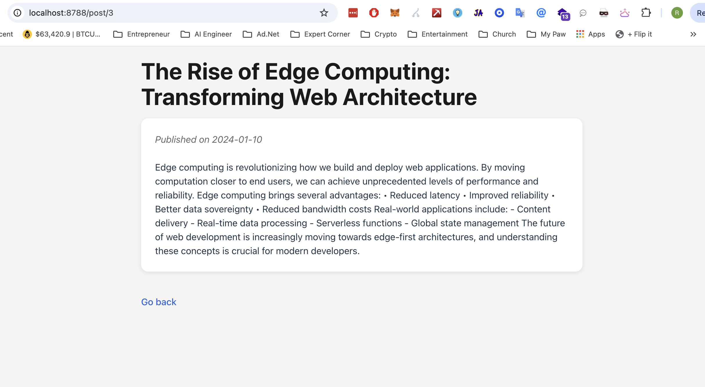

# React + Vite

## Define the frontend
1. Main page in `src/main.jsx`
2. Define the routes in `src/App.jsx`
3. Create the `src/components/posts.jsx` and `src/components/post.jsx` components
4. Component uses fetch to get data from the API (see below)
5. Customize the look and feel in `src/index.css`

```javascript
    useEffect(() => {
        const getPost = async () => {
            const response = await fetch(`/api/post/${id}`);
            const postResponse = await response.json();
            setPost(postResponse);
        };
        getPost();
    }, [id]);
```

## UI
### Post List




### Post Detail



## Backend API using Cloudflare Pages Functions
5. Create the `functions/api/posts.js` function for the posts list
6. Create the `functions/api/post/[[id]].js` function for the post detail
7. Mock data in `functions/api/post/data.js`
8. Customize the look and feel in `src/index.css`


## Commands

```bash
 npm install react-router-dom

# Add this to your package.json scripts
"scripts": {
  "pages:dev": "npx wrangler pages dev -- npm run dev"
}

# Then you can run (Ready on http://localhost:8788)
npm run pages:dev

```
