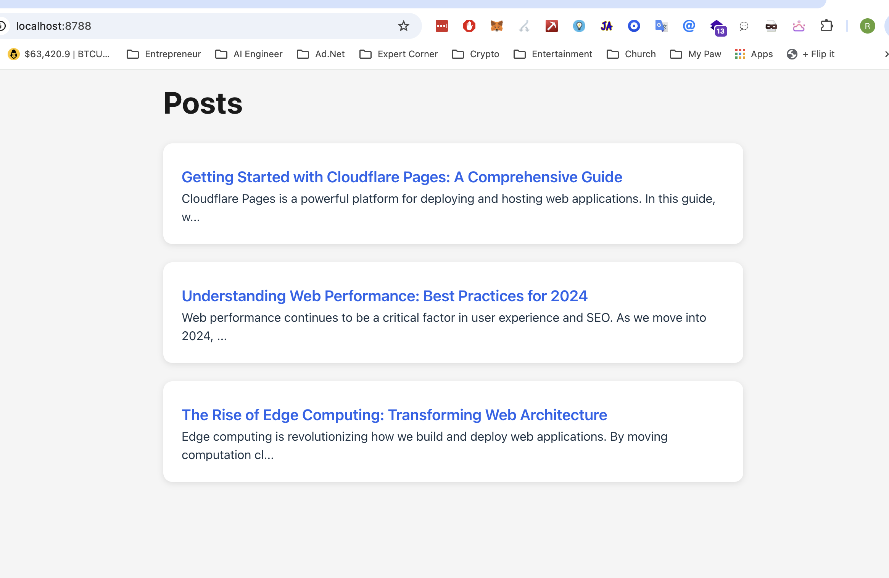
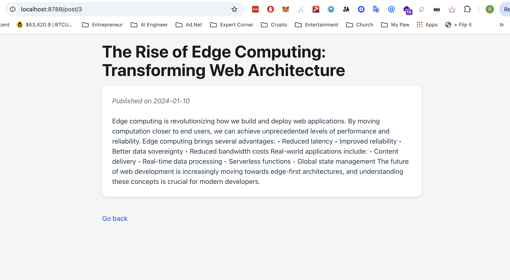

# Next JS 14 with Cloudflare Pages


## Migration from Vite to Next.js
Next.js is a complete framework that includes: (so vite is not needed)
* Its own build tool (based on webpack)
* Development server
* File-based routing
* Server-side features
* API routes
* Edge runtime support

### Key Changes
1. **Project Structure**
   - Moved from Vite to Next.js App Router
   - Removed Vite files (`vite.config.js`, `index.html`)
   - Consolidated styles into `src/app/globals.css`

2. **Configuration**
   - Added `next.config.js` for Cloudflare Pages optimization:   
   
   ```javascript
     const nextConfig = {
       assetPrefix: process.env.NODE_ENV === 'production' ? '/_next' : '',
       distDir: '.next',
       generateBuildId: async () => 'build'
     }     
   ```
   - Updated dependencies in `package.json` to Next.js ecosystem

3. **Routing**
   - Migrated from React Router to Next.js App Router
   - Routes structure:
     * `app/page.jsx` → / (home page)
     * `app/post/[id]/page.jsx` → /post/123 (dynamic route)

4. **Components**
   - Added `'use client'` directive for client components
   - Updated imports to use Next.js components
   - Maintained component structure in `src/components/`

## Project Structure

```bash
your-project/
├── src/
│ ├── app/ # Next.js pages and layouts
│ ├── components/ # React components
│ └── lib/ # Utilities (if needed)
├── functions/ # Cloudflare Pages Functions
├── public/ # Static assets
├── next.config.js # Next.js configuration
└── package.json # Project dependencies
```

## Getting Started

First, install dependencies:

```bash
npm install
```

Then, set up your environment:

```bash
# Create .env.local from template
npm run setup:env

# Edit .env.local with your KV namespace IDs
# KV_NAMESPACE_ID=your-production-namespace-id
# KV_NAMESPACE_PREVIEW_ID=your-preview-namespace-id

# Generate wrangler.toml with your KV IDs
npm run setup:wrangler
```

Or you can run the complete setup in one command (but remember to edit .env.local before running any other commands):
```bash
npm run setup
```

Now you can build and run the development server:

```bash
# build
npm run build

# Run the development server with Cloudflare Pages
# Ready on http://localhost:8789
npm run pages:dev
```

To deploy to production:
```bash
npm run deploy
```

## Edge Runtime
* The pages will run on Cloudflare's edge network
* This aligns with your Cloudflare Pages Functions which are also running at the edge
* You get better performance as both your pages and APIs are running close to your users


## UI
### Post List




### Post Detail



## KV Store Setup

```bash
# create kv namespace (case insensitive)
wrangler kv:namespace create qa_posts

# create kv namespace for development
wrangler kv:namespace create qa_posts --preview

# update wrangler.toml
[[kv_namespaces]]
binding = "QA_POSTS"
preview_id = "your_preview_id_here"  # For local development
id = "your_production_id_here"       # For production

# upload data from data/posts.json
wrangler kv:bulk put --binding=QA_POSTS data/posts.json --preview false
wrangler kv:bulk put --binding=QA_POSTS --preview data/posts.json

# list kv namespaces
wrangler kv:namespace list [--preview]
# delete kv namespace
wrangler kv:namespace delete qa_posts [--preview]

```

